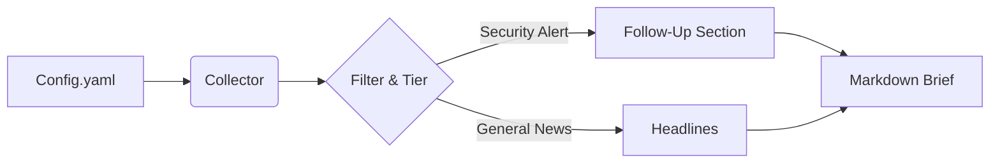

# Morning Brief ☕️

> Your automated daily dose of tech news: AI, DevOps, InfoSec, and more.


## The Goal 🎯

Honestly, I was tired of opening 50+ tabs every morning to check the same blogs. I wanted to see if I could build a robot to read the internet for me while I sip my coffee.

**Morning Brief** assumes the role of a personal research assistant. It checks my favorite RSS feeds, crawls a few specific sites, filters out the noise using a tiered priority system, and hands me a clean, easy-to-read Markdown summary.

It was also the perfect excuse to finally take **Bun** for a spin in a real project!

## How it Works (Simply Put) ⚙️

It's a linear pipeline that runs on my laptop (or a cheap VPS):

1.  **Wake Up**: The script runs (manually or via cron).
2.  **Read the Map**: It loads `sources/feeds.yaml` to know where to look.
3.  **Gather**: It fetches the latest posts from RSS feeds and crawls non-RSS sites using [Firecrawl](https://firecrawl.dev) (if API key is set) with automatic fallback to local HTML parsing via cheerio.
4.  **Curate**: It applies my "Tier System" logic:
    *   *Security Critical*: Always show me these (0-days, major breaches).
    *   *Core Tech*: Cap at 8 articles.
    *   *Research*: Rotate sources so I don't get bored.
5.  **Deliver**: A fresh `morning_brief_YYYY-MM-DD.md` files appears in the `output/` folder.



## Today I Learned (TIL) 📝

*   **RSS is chaotic**: I learned the hard way that no two RSS feeds are formatted exactly alike. Handling dates and mismatched tags was... an adventure.
*   **Bun is fast**: I'm used to Node.js, but Bun's startup time for a CLI tool like this is instant. Plus, having TypeScript support out of the box is a game changer for "weekend hacking."
*   **Web scraping needs resilience**: Many sites block crawling services like Firecrawl, but basic HTML fetching with cheerio works great as a fallback. The dual-strategy approach (try Firecrawl, fall back to local) ensures content always gets through.

## Running the Lab 🧪

Works on my machine, and it should work on yours if you have Bun installed!

1.  **Clone the repo:**
    ```bash
    git clone https://github.com/daryllundy/morning-brief.git
    cd morning-brief
    ```

2.  **Install dependencies:**
    ```bash
    bun install
    ```

3.  **Configure:**
    *   Check `sources/feeds.yaml` to see the structure.
    *   (Optional) Set `FIRECRAWL_API_KEY` in your environment to use Firecrawl for web crawling. If not set, the system automatically falls back to local HTML parsing.

4.  **Run it:**
    ```bash
    bun run src/index.ts
    ```

5.  **Enjoy:** Check the `output/` directory for your brief!

## Tech Stack 🛠️

*   **Runtime:** [Bun](https://bun.sh) (Fast, all-in-one toolkit)
*   **Language:** TypeScript
*   **Core Logic:**
    *   `rss-parser`: For taming the RSS beast.
    *   `cheerio`: For parsing HTML when crawling websites.
    *   `js-yaml`: For friendly configuration files.
    *   `date-fns`: Because time zones are hard.
    *   `node-cron`: For scheduling (when running as a daemon).

## Let's Connect 🤝

I'm always tweaking the curation logic. If you have ideas for better filtering algorithms or just want to chat about building personal tools, hit me up!

*   [Open an Issue](https://github.com/daryllundy/morning-brief/issues)
*   [Check out my other projects](#)

---
*Happy Reading!* 📖
