# Morning Brief ☕️

> Your automated daily dose of tech news: AI, DevOps, InfoSec, and more.


## The Goal 🎯

Honestly, I was tired of opening 50+ tabs every morning to check the same blogs. I wanted to see if I could build a robot to read the internet for me while I sip my coffee.

**Morning Brief** assumes the role of a personal research assistant. It checks my favorite RSS feeds, crawls a few specific sites, filters out the noise using a tiered priority system, and hands me a clean, easy-to-read Markdown summary.

It was also the perfect excuse to finally take **Bun** for a spin in a real project!

## Quick Start 🚀

```bash
# Clone the repo
git clone https://github.com/yourusername/morning-brief.git
cd morning-brief

# Install dependencies
bun install

# Run it manually
./cron.sh

# Or install to run daily at 5:00 AM
./install-launchd.sh
```

**That's it!** Check `INSTALL.md` for detailed setup instructions.

## How it Works (Simply Put) ⚙️

It's a linear pipeline that runs wherever you install it:

1.  **Wake Up**: The script runs (manually or via scheduler).
2.  **Read the Map**: It loads `sources/feeds.yaml` to know where to look.
3.  **Gather**: It fetches the latest posts from RSS feeds and crawls non-RSS sites using [Firecrawl](https://firecrawl.dev) (if API key is set) with automatic fallback to local HTML parsing via cheerio.
4.  **Curate**: It applies my "Tier System" logic:
    *   *Security Critical*: Always show me these (CVEs, 0-days, major breaches).
    *   *Core Tech*: Cap at 8 articles.
    *   *Research*: Rotate sources so I don't get bored.
5.  **Deliver**: A fresh `morning_brief_YYYY-MM-DD.md` file appears in the `output/` folder.

```mermaid
graph LR
    A[Config.yaml] --> B(Collector);
    B --> C{Filter & Tier};
    C -->|CVE/Critical| D[🚨 CVE Section];
    C -->|Security| E[🔖 Security Section];
    C -->|General News| F[Headlines];
    D --> G[Markdown Brief];
    E --> G;
    F --> G;
```



## Features ✨

- **100% RSS Success Rate** - Smart retry logic, XML sanitization, SSL handling
- **Dedicated CVE Section** - Critical vulnerabilities surfaced immediately
- **Dual Crawl Strategy** - Firecrawl API with cheerio fallback for blocked sites
- **Portable** - Works anywhere you clone it, no hardcoded paths
- **Smart Curation** - Tier-based filtering with source rotation
- **Scheduled or Manual** - Run on-demand or daily at 5:00 AM

## Today I Learned (TIL) 📝

*   **RSS is chaotic**: I learned the hard way that no two RSS feeds are formatted exactly alike. Handling dates and mismatched tags was... an adventure.
*   **Bun is fast**: I'm used to Node.js, but Bun's startup time for a CLI tool like this is instant. Plus, having TypeScript support out of the box is a game changer for "weekend hacking."
*   **Web scraping needs resilience**: Many sites block crawling services like Firecrawl, but basic HTML fetching with cheerio works great as a fallback. The dual-strategy approach (try Firecrawl, fall back to local) ensures content always gets through.

## Tech Stack 🛠️

*   **Runtime:** [Bun](https://bun.sh) (Fast, all-in-one toolkit)
*   **Language:** TypeScript
*   **Core Logic:**
    *   `rss-parser`: For taming the RSS beast.
    *   `cheerio`: For parsing HTML when crawling websites.
    *   `js-yaml`: For friendly configuration files.
    *   `date-fns`: Because time zones are hard.
    *   `node-cron`: For scheduling (when running as a daemon).

## Configuration 📝

Edit `sources/feeds.yaml` to customize:
- RSS feed sources (organized by tier)
- Crawl-only URLs
- Article caps per tier
- Time window (default: 18 hours)

See `CLAUDE.md` for detailed architecture documentation.

## Output Format 📄

Daily briefs are generated in `output/` with sections:
1. **Headlines** - All selected articles with metadata
2. **🚨 CVE & Critical Vulnerabilities** - Immediate review required
3. **🔖 Security Incidents & Threats** - Secondary security items
4. **Crawled Sources** - Full content from non-RSS sources

## Let's Connect 🤝

I'm always tweaking the curation logic. If you have ideas for better filtering algorithms or just want to chat about building personal tools, hit me up!

*   [Open an Issue](https://github.com/yourusername/morning-brief/issues)
*   [Check out my other projects](#)

---
*Happy Reading!* 📖
